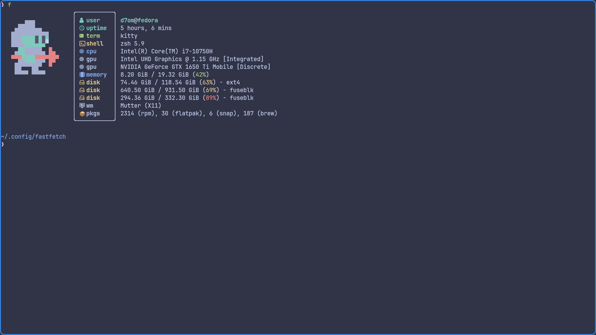
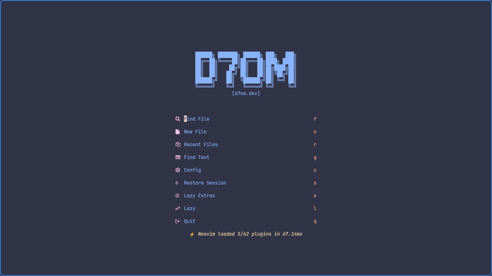

# dotfiles

This repo contains the configuration to setup my machines.

This is using [Chezmoi](https://chezmoi.io), the dotfile manager to setup the install.

This automated setup is currently only configured for Fedora machines.

## How to use

Simply run the following command:

- When prompted `BECOME password:` enter your "sudo" password.

```shell
sh -c "$(curl -fsLS get.chezmoi.io)" -- init --apply abdulrahmanDev1
```

## Preview

| Application | Screenshot                                      |
| ----------- | ----------------------------------------------- |
| Kitty       |      |
| fastfetch   |  |
| nvim        |       |

## What does it do?

<details>
<summary>Apps Installed</summary>

- Homebrew
- Brave Browser
- Visual Studio Code
- Docker
- Flatpak packages:
  - com.obsproject.Studio
  - org.videolan.VLC
  - org.tenacityaudio.Tenacity
  - md.obsidian.Obsidian
  - org.gimp.GIMP
  - org.gnome.meld
  - org.sqlitebrowser.sqlitebrowser
  - us.zoom.Zoom
  - org.gnome.World.PikaBackup
  - com.mattjakeman.ExtensionManager
  - org.freedesktop.Platform
  - nl.hjdskes.gcolor3
  </details>

<details>
<summary>Packages Installed</summary>

- Homebrew packages:
  - lazygit
  - eza
  - trash-cli
  - tldr
  - thefuck
  - python
  - pipx
  - bat
  - zsh-syntax-highlighting
- DNF packages:
  - git
  - btop
  - neovim
  - firefox
  - gh
  - gnome-tweaks
  - ripgrep
  - zsh
  - fzf
  - tmux
  - openssl-devel
  - gdbm-libs
  - libnsl2
  - luarocks
  - wl-clipboard
  - fd-find
  - "@Development Tools"
  - autoconf
- Docker packages:
  - docker-ce
  - docker-ce-cli
  - containerd.io
  - docker-buildx-plugin
  - docker-compose-plugin
  </details>

<details>
<summary>Modifications Made</summary>

- Ensures Homebrew is installed
- Updates Homebrew
- Installs Homebrew packages
- Upgrades Homebrew packages
- Changes shell to zsh
- Adds Brave Browser Repo
- Imports Brave Browser GPG Key
- Installs Brave Browser
- Imports Microsoft GPG Key
- Adds Visual Studio Code Repo
- Installs VS Code
- Adds Docker repo
- Installs Docker
- Adds Docker group
- Adds user to docker group
- Installs Flatpak packages
- Ensures fonts directory
- Checks if Jetbrains Mono exists
- Downloads Jetbrains mono

</details>

<details>
<summary>Configurations</summary>

- zsh Configuration
- tmux Configuration
- neovim Configuration
- rofi Configuration
  - Refer to [adi1090x/rofi](https://github.com/adi1090x/rofi) for more information
- kitty terminal Configuration
  - Refer to [kitty README](./dot_config/kitty/executable_README.md) for more information
- fastfetch Configuration

**Note**: run `cat ~/.aliasesrc` to see the aliases that are configured

</details>

---

This script uses Ansible, a configuration management tool.

Ansible is used to automate the process of setting up a machine with the specified applications, packages, and configurations.
